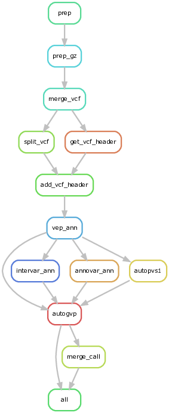

# Snakemake workflow to predict P/LP (pathogenic/likely pathogenic variants) using AutoGVP

## Introduction 

This new Snakemake workflow is to annotate variants using [AutoGVP](https://github.com/diskin-lab-chop/AutoGVP/tree/main).  It splits the input vcf files in multiple chunks as the [original pipeline](https://github.com/NCI-CGR/PLP_prediction_workflow/tree/main).  The main AutoGVP worflow followed Jung's bash script (/data/CGB_share/autoGVP_submit.sh @ biowulf).




---

## Methods
As the orignal workflow has not be designed and tested for hg19, we made some minor revisios in certain steps. 

### The major components of the workflow
+ [Configure file](config/genomel_config.yaml)
+ [Snakefile](workflow/Snakefile)
+ [The wrapper script to launch the workflow at Biowulf](./run_it2.sh)

```bash
#!/bin/bash
#SBATCH --time=2-00:00:00
#SBATCH -o ${PWD}/snakemake.%j.out
#SBATCH -e ${PWD}/snakemake.%j.err


module load singularity

mkdir -p TMP
export TMPDIR=TMP

# conda activate snakemake
snakemake --profile workflow/profiles/biowulf --verbose -p --use-conda --jobs 400 --default-resources "mem_mb=10000  " --use-envmodules --use-singularity --singularity-args " -B /vf,/spin1,/data,/fdb,/gpfs "  --latency-wait 120 -T 0 -s workflow/Snakefile --configfile $1
```

### Layout of the workspace and the worklfow
+ /data/GenoMEL/AutoGVP/AutoGVP/data
  + Homo_sapiens_assembly19.fasta
  + clinvar_20231230.vcf.gz
  + clinvar_20231230.vcf.gz
  + variant_summary.txt.gz
  + ClinVar-selected-submissions.tsv
+ /data/GenoMEL/PLP_prediction_workflow [working directory]
  + run_it2.sh
  + config/genomel_config.yaml
  + workflow/Snakefile
  + output/
    + merge_call


### Revisions to run AutoGVP
#### Input VCF files
There is no special requirement by AutoGVP for the VCF input files.  We removed the original annotation and the format columns to reduce file size and avoid any conflict due to the existing annotations.  This step has been builted in the workflow.
```bash
bcftools view -e 'ALT="*"' -Ou {input} |bcftools norm -m-both -Ou --threads {threads} | bcftools norm -f {params.ref} | bcftools annotate -Ou -x ID  -I +"%CHROM:%POS:%REF:%ALT" --threads {threads} | bcftools annotate -Oz -x FORMAT,^INFO/AC,^INFO/AF,^INFO/AN -o {output.vcf}
      tabix -p vcf {output.vcf}
```

#### Vep 
The module "VEP/104" is used for the Vep annotation at Biowulf, as suggested by Jung.  We introduced parameter *{params.grc}* ("GRCh37" is used for hg19):
+ --fasta $VEP_CACHEDIR/{params.grc}.fa
+ --assembly {params.grc}

#### Intervar 
In this step, we used locally installed InterVar for the standard configure setting (where instervar databases under intervardb were used):
+ [/home/zhuw10/git/InterVar-2.2.1/config.ini](./data/intervar_config.ini) 
```ini
[InterVar]
buildver = hg19 
# hg19 
inputfile = example/ex1.avinput
# the inputfile and the path  example/ex1.avinput hg19_clinvar_20151201.avinput
# tab-delimited will be better for including the other information
inputfile_type = AVinput
# the input file type VCF(vcf file with single sample),AVinput,VCF_m(vcf file with multiple samples)
outfile = example/myanno
# the output file location and prefix of output file
database_intervar = intervardb
# the database location/dir for Intervar
lof_genes = %(database_intervar)s/PVS1.LOF.genes
pm1_domain = %(database_intervar)s/PM1_domains_with_benigns
mim2gene = %(database_intervar)s/mim2gene.txt
# morbidmap = %(database_intervar)s/morbidmap.txt
# disabled for BP5 as reviewer suggested. for OMIM, only mim2gene.txt needed. 
mim_recessive = %(database_intervar)s/mim_recessive.txt
mim_domin = %(database_intervar)s/mim_domin.txt
mim_adultonset = %(database_intervar)s/mim_adultonset.txt
mim_pheno = %(database_intervar)s/mim_pheno.txt
mim_orpha = %(database_intervar)s/mim_orpha.txt
#orpha = %(database_intervar)s/orpha.txt
orpha = %(database_intervar)s/orpha.txt.utf8
knowngenecanonical = %(database_intervar)s/knownGeneCanonical.txt
pp2_genes = %(database_intervar)s/PP2.genes
bp1_genes = %(database_intervar)s/BP1.genes
ps1_aa = %(database_intervar)s/PS1.AA.change.patho
# do not add the builder version
ps4_snps = %(database_intervar)s/PS4.variants
# do not add the builder version
bs2_snps = %(database_intervar)s/BS2_hom_het
# do not add the builder version
exclude_snps = %(database_intervar)s/ext.variants
# do not add the builder version,the variant in this list will not check the frequency, it is causal.
# the list should be tab-delimited,format like this:
# Chr Pos Ref_allele Alt_allele
evidence_file = None
# add your own Evidence file for each Variant:
# evidence file as tab-delimited,format like this:
# Chr Pos Ref_allele Alt_allele  PM1=1;BS2=1;PP2=0
disorder_cutoff = 0.01
#It is for BS1: Allele frequency is greater than expected for disorder
[InterVar_Bool]
onetranscript = TRUE 
# TRUE or FALSE: print out only one transcript for exonic variants (default: FALSE/all transcripts)
otherinfo = FALSE              
# TRUE or FALSE: print out otherinfo (infomration in fifth column in queryfile,default: FALSE)
# this option only perform well with AVinput file,and the other information only can be put in the fifth column.  The information in >5th column will be lost.
# When input as  VCF or VCF_m files with otherinfo option, only het/hom will be kept, depth and qual will be lost.
[Annovar]
# the ANNOVAR version should be >=  2016-02-01, older verions of ANNOVAR will bring problems.
convert2annovar = ./convert2annovar.pl
#convert input file to annovar format
table_annovar = ./table_annovar.pl
# table_annovar.pl of file location
annotate_variation = ./annotate_variation.pl
# annotate_variation of file location
database_locat = humandb 
# the database location/dir from annnovar   check if database file exists
#database_names = refGene esp6500siv2_all 1000g2015aug avsnp147 dbnsfp33a clinvar_20190305 gnomad_genome dbscsnv11 dbnsfp31a_interpro rmsk ensGene knownGene
database_names = refGene esp6500siv2_all 1000g2015aug avsnp147 dbnsfp42a clinvar_20210501 gnomad_genome dbscsnv11 rmsk ensGene knownGene
# specify the database_names from ANNOVAR or UCSC
[Other]
current_version = Intervar_20210727 
# pipeline version
public_dev = https://github.com/WGLab/InterVar/releases
```

In the workflow, we had introduced the setting from the module *annovar* to reduce the dependencies on the local settings at Biowulf:
```bash
/home/zhuw10/git/InterVar-2.2.1/Intervar.py -i {input.vcf} --input_type=VCF -o {params.prefix} -b {params.genome} -t /home/zhuw10/git/InterVar-2.2.1/intervardb -d $ANNOVAR_DATA/{params.genome} --table_annovar=$ANNOVAR_HOME/table_annovar.pl --convert2annovar=$ANNOVAR_HOME/convert2annovar.pl --annotate_variation=$ANNOVAR_HOME/annotate_variation.pl
```

#### autopvs1

We made a revision at /data/CGB_share/autopvs1_wz/autoPVS1_from_VEP_vcf.py to introdue genome_version option back to the python script:

```bash
python /data/CGB_share/autopvs1_wz/autoPVS1_from_VEP_vcf.py --genome_version {params.genome} --vep_vcf {input.vcf} > {output}
```

Besides, we had copied the reference genomes to the folder /data/CGB_share/autopvs1_wz/data, and revised the file [config.ini](data/autopvs1_config.ini) accordingly for autopvs1.

#### AnnoVar
We used the annovar module installed at Biowulf with the data sets  "--protocol *gnomad211_exome*,*gnomad211_genome*", which are opted for the WES data on hg19.

:bookmark: this setting needs to be customized for other studies in the future.

#### Prepare ClinVar data for the use of hg19
To run AutoGVP, latest ClinVar data need to be downloaed and prepared. 

```bash
cd /data/GenoMEL/AutoGVP
git clone git@github.com:diskin-lab-chop/AutoGVP.git


wget -nc -e robots=off --reject "index.html*" -r --level=1  -nd -np -A "clinvar_20231230.vcf.gz*" -P data/ https://ftp.ncbi.nlm.nih.gov/pub/clinvar/vcf_GRCh37/

wget https://ftp.ncbi.nlm.nih.gov/pub/clinvar/tab_delimited/submission_summary.txt.gz -P data/

wget https://ftp.ncbi.nlm.nih.gov/pub/clinvar/tab_delimited/variant_summary.txt.gz -P data/

ls -al data/
total 514410
drwxr-s--- 2 zhuw10 GenoMEL      4096 Jan  4 11:02 .
drwxr-sr-x 2 zhuw10 GenoMEL      4096 Jan  4 10:56 ..
-rw-r--r-- 1 zhuw10 GenoMEL  91217146 Dec 31 02:44 clinvar_20231230.vcf.gz
-rw-r--r-- 1 zhuw10 GenoMEL       126 Dec 31 02:44 clinvar_20231230.vcf.gz.md5
-rw-r--r-- 1 zhuw10 GenoMEL    522144 Dec 31 02:44 clinvar_20231230.vcf.gz.tbi
-rw-r--r-- 1 zhuw10 GenoMEL 211364657 Dec 30 19:27 submission_summary.txt.gz
-rw-r--r-- 1 zhuw10 GenoMEL 223649945 Dec 31 00:33 variant_summary.txt.gz

### run select-clinVar-submissions_hg19.R
# to have ClinVar-selected-submissions.tsv
module load singularity
singularity pull docker://pgc-images.sbgenomics.com/naqvia/autogvp:latest

singularity exec -B $PWD:/share  --pwd /share autogvp_latest.sif Rscript ./AutoGVP/scripts/select-clinVar-submissions_hg19.R --variant_summary data/variant_summary.txt.gz --submission_summary data/submission_summary.txt.gz --outdir data/
```

#### Run AutoGVP
After all the input files prepared for the use of hg19, AutoGVP is ready to be launched via container *docker://pgc-images.sbgenomics.com/naqvia/autogvp:latest*

#### Output
The final merged tab-delimited files are generated under output. The format is as [described](https://github.com/diskin-lab-chop/AutoGVP/tree/main#autogvp-output), with one additional column "vid" (e.g., 1:12198:G:C). 
```bash
tree output/merge_call/
output/merge_call/
├── genomel.autogvp_abridged.tsv
└── genomel.autogvp_full.tsv


```


---

### Annotation data sources used in this analysis.

+ Table 1. Comparison of the annotation tools used between AutoGVP and the original P/LP prediction workflow.
  
| Annotation Tool | AutoGVP                          | Original P/LP prediction pipeline                                                                                                                                                       |
|-----------------|----------------------------------|-----------------------------------------------------------------------------------------------------------------------------------------------------------------------------------------|
| VEP             | VEP/104 (/fdb/VEP/104/cache)     | NA                                                                                                                                                                                      |
| snpEff          | NA                               | snpEff/5.1d                                                                                                                                                                             |
| annovar         | annovar/2020-06-08               | annovar/2020-06-08                                                                                                                                                                      |
|   --protocols   | gnomad211_exome,gnomad211_genome | refGene,knownGene,ensGene,exac03nontcga,gnomad211_exome,gnomad211_genome,esp6500siv2_all,1000g2015aug_all,clinvar_20210123,dbnsfp41a,dbscsnv11,spliceai_filtered,spidex,cosmic92_coding |
| InterVar        | Version 2.2.1                    | Version 2.2.1                                                                                                                                                                           |
| ClinVar         | clinvar_20231230                 | clinvar_20210123 (via annovar)                                                                                                                                                          |
| AutoPSV1        | v2.0-2-g7fb1be9                  | NA                                                                                                                                                                                      |

:bookmark: It is noted that annotation approaches are significantly different between the two workflows, but the same version of InterVar were used.  One of the differences to be highlighted is the data source of the ClinVar: *clinvar_20210123* was used and annotated variants via AnnoVar, whereas *clinvar_20231230* was used directly by *AutoGVP*.