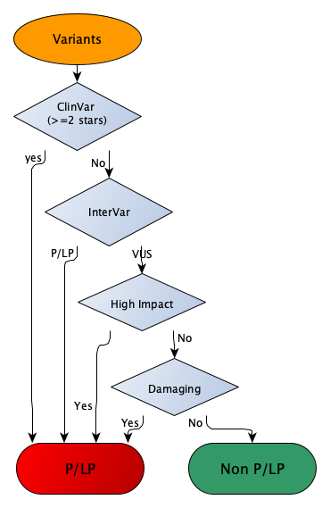

# Snakemake workflow to predict P/LP (pathogenic/likely pathogenic variants)

## Introduction 

Assuming the input data are a list of VCF files (for examples, multiple-sample VCF files split by chromosomes or genes), this workflow runs annovar, intervar and snpEff to predict P/LP variants in two ways: 1. Clinvar+Intervar (CI); 2. Jung's criteria as descried in [this paper](https://doi.org/10.1016/j.cancergen.2020.10.002) (as I learned from Jung Kim  ). The first method is straightforward, that is, the variant is predicted by as P/LP by either InterVar or ClinVar (with the CLINSTAT tag as "criteria_provided,_multiple_submitters,_no_conflicts",  "practice_guideline",  or "reviewed_by_expert_panel").  The second method is described in the [paper](https://doi.org/10.1016/j.cancergen.2020.10.002).  I named it "Jung's criteria" as I learned it from Dr. Jung Kim (and I have no idea how to call it ).  

Assuming the input data are a list of VCF files (for examples, multiple-sample VCF files split by chromosomes or genes), this workflow runs annovar, intervar and snpEff to predict P/LP variants in two ways: 1. Clinvar+Intervar (CI); 2. Jung's criteria as descried in [this paper](https://doi.org/10.1016/j.cancergen.2020.10.002). The first method is straightforward, that is, the variant is predicted by as P/LP by either InterVar or ClinVar (with the CLINSTAT tag as "criteria_provided,_multiple_submitters,_no_conflicts", "practice_guideline", or "reviewed_by_expert_panel").  The second method is a little complicated, as described in the [paper](https://doi.org/10.1016/j.cancergen.2020.10.002).  I named it "Jung's criteria" as I learned it from Dr. Jung Kim (and I have no idea how to call it in a better way :) ).  Briefly, it is a union set of Clinvar+InterVar and two other variant sets based on the variant annotations from InterVar, AnnoVar and snpEff:
1. variants with High impact (snpEff);
2. variants meeting all the following criteria;
   + Variants are predicted as VUS (variants of uncertain significance) by InterVar;
   + Variants meets "3/4", "2/3", or "3/7"
     + Predicted as ”damaging” missense mutations by 3 out of the 4 predictions;
     + Predicted as "damaging" splice site mutations by 2 out of 3 predictions;
     + Predicted as "damaging" missense or splice site mutations by 3 out of 7 predictions;
  
The overall process is as described in the diagram below: 





Users may have a look of the R script [Call_patho.R]( workflow/scripts/Call_patho.R) to understand how P/LP variants are actually predicted.


There are several steps taking in this Snakemake workflow as outlined in [this diagram](./workflow/plp_dag_expand.pdf):
+ Merge input vcf files into one file; 
  + :bookmark: Only the first 8 columns of the VCF files are used so as to reduce the file size and facilitate the subsequent data processing.
+ Split vcf files into multiple parts to speed up the annotation process.  
+ Annotate each split part by *InterVar*, *Annovar* and *snpEff*.
+ Call P/LP variants using the R script [Call_patho.R]( workflow/scripts/Call_patho.R).
  + There are two output files generated in this step: *{chunk}.plp.txt* and *{chunk}.plp_slim.txt*
    +  All the essential  output from the variant annotators are kept in the *plp.txt* file (see [this example](data/output/00027.plp.tsv)).
    +  The plp_slim.txt file has only 8 columns (see [this example](data/output/00027.plp_slim.tsv)):
    

| vid              | Gene.refGene   | popmax_freq | PLP.clinvar | PLP.intervar | PLP.impactHigh | PLP.genomel | PLP.m_sp | PLP.jung |
| ---------------- | -------------- | ----------- | ----------- | ------------ | -------------- | ----------- | -------- | -------- |
| 4:186317998:C:A  | ANKRD37;LRP2BP | 0           | FALSE       | FALSE        | FALSE          | FALSE       | FALSE    | FALSE    |
| 4:186318030:C:T  | ANKRD37;LRP2BP | 0           | FALSE       | FALSE        | FALSE          | FALSE       | FALSE    | FALSE    |
| 4:186318071:G:A  | ANKRD37;LRP2BP | 1.00E-04    | FALSE       | FALSE        | FALSE          | FALSE       | FALSE    | FALSE    |
| 4:186318186:G:A  | LRP2BP         | 0           | FALSE       | FALSE        | FALSE          | FALSE       | FALSE    | FALSE    |
| 4:186318261:G:A  | LRP2BP         | 8.00E-04    | FALSE       | FALSE        | FALSE          | FALSE       | FALSE    | FALSE    |
| 4:186318265:A:G  | LRP2BP         | 6.84E-05    | FALSE       | FALSE        | FALSE          | FALSE       | FALSE    | FALSE    |
| 4:186318282:T:TG | LRP2BP         | 0           | FALSE       | FALSE        | FALSE          | FALSE       | FALSE    | FALSE    |


+ Below is the description of the columns in the slim file

| Column ID      | Description                                                                                                      |
| -------------- | ---------------------------------------------------------------------------------------------------------------- |
| vid            | Variant ID in the format of CHROM:POS:REF:ALT                                                                    |
| Gene.refGene   | Gene ID                                                                                                          |
| popmax_freq    | Maximum AF among the subpopulations (derived from "AF_popmax" and "non_cancer_AF_popmax")                        |
| PLP.clinvar    | P/LP defined by ClinVar                                                                                          |
| PLP.intervar   | P/LP defined by InterVar                                                                                         |
| PLP.impactHigh | P/LP defined by high impact                                                                                      |
| PLP.genomel    | P/LP defined ***(impact == 'HIGH') \| (impact == "MODERATE" & Polyphen2_HDIV_pred == 'D')***                           |
| PLP.m_sp       | P/LP defined as Damaging missense and/or splite site mutations                                                   |
| PLP.jung       | P/LP defined by ***PLP.clinvar \| PLP.intervar \| PLP.impactHigh \| (intervar=="Uncertain significance" & PLP.m_sp)*** |


---

## Dependencies
### Snakemake (Version 7.3.7+)
Even though Snakemake module is available at Biowulf, a conda installed Snakemake is recommend. In this study, Snakemake (Version 7.3.7) was used. 

### Conda (Version 4.12.0)
Conda is also used in the workflow to create a working environment to call P/LP using R.
+ workflow/envs/plp.yaml
```yml
channels:
  - conda-forge
dependencies:
  - r-base =4.2.1
  - r-bigreadr =0.2.4
  - r-rlang =1.0.6
  - r-tidyverse =1.3.2
```

### Biowulf modules
This workflow has taken full advantage of the modules installed at Biowulf (non-biowulf users may use conda instead): 
+ bcftools/1.13
+ annovar/2020-06-08
+ snpEff/5.1d
+ csvkit/1.0.7

### InterVar (Version 2.2.1)
By the time of development, the latest module of intervar at Biowulf is Version 2.1.3.  So, I had installed InterVar (Version 2.2.1) locally, with the InterVar database under /home/zhuw10/git/InterVar-2.2.1/.   

```bash
/home/zhuw10/git/InterVar-2.2.1/Intervar.py -i {input} -b {params.
genome} -d $ANNOVAR_DATA/{params.genome} -o {params.prefix} -t /home/zhuw10/git/InterVar-2.2.1/intervardb --table_annovar=$ANNOVAR_HOME/table_annova
r.pl --convert2annovar=$ANNOVAR_HOME/convert2annovar.pl --annotate_variation=$ANNOVAR_HOME/annotate_variation.pl 2>{log}
```

Currently, the module "intervar/2.2.1" is available at Biowulf, so users may just update: */home/zhuw10/git/InterVar-2.2.1/Intervar.py* and */home/zhuw10/git/InterVar-2.2.1/intervardb* accordingly:

```bash
module show  intervar/2.2.1
----------------------------------------------------------------------
   /usr/local/lmod/modulefiles/intervar/2.2.1.lua:
----------------------------------------------------------------------
help([[This module sets up the environment for using InterVar.
]])
whatis("InterVar: Clinical Interpretation of Genetic Variants")
whatis("Version: 2.2.1")
setenv("INTERVAR_HOME","/usr/local/apps/intervar")
setenv("INTERVAR_BIN","/usr/local/apps/intervar/2.2.1/bin")
setenv("INTERVAR_TEST","/usr/local/apps/intervar/TEST_DATA/example")
setenv("INTERVAR_DATA","/usr/local/apps/intervar/DOWNLOADS/InterVar")
prepend_path("PATH","/usr/local/apps/intervar/2.2.1/bin")
prepend_path("PATH","/usr/local/apps/annovar/2020-06-08")
setenv("ANNOVAR_HOME","/usr/local/apps/annovar/2020-06-08")
setenv("ANNOVAR_DATA","/fdb/annovar/2020-06-08")
setenv("ANNOVAR_DATA_CURRENT","/fdb/annovar/current")
```

---

## Input files and configuration
All input files are configured in one yaml file for the workflow:

+ Example of the configure file of hg38
```yml
# given a list vcf file under the folder
vcf_input_dir: "/data/zhuw10/ukbb/dnanexus/pvcf2"

### output_dir is sufficient to keep data unique and output_prefix is to for the merged file
output_dir: "/data/zhuw10/ukbb/dnanexus/batch2"
output_prefix: "ukb_batch2"
ref: "/data/zhuw10/ukbb/ref/GRCh38_full_analysis_set_plus_decoy_hla.fa"
genome: "hg38"
split_total: 100

# for GRCh38.99 
snpEff_db: "GRCh38.99" 
```

+ Example of the configure file of hg19
```yml
# given a list vcf file under the folder
vcf_input_dir: "/data/zhuw10/ukbb/data/genomel_vcf"

### output_dir is sufficient to keep data unique and output_prefix is to for the merged file
output_dir: "/data/zhuw10/ukbb/dnanexus/genomel_out"
output_prefix: "prj1"
ref: "/data/zhuw10/ukbb/ref/Homo_sapiens_assembly19.fasta"
genome: "hg19"
split_total: 100

# for GRCh38.99 
snpEff_db: "GRCh37.87" 
```

Overall, there are several input files are required:
+ VCF input files under the specified folder *vcf_input_dir*.
+ The reference genome (specified by *ref*) in the fasta format with *fai* index.

Besides, there are several parameters defined in the configure file.
+ output_dir, specified the output folder.
+ genome, specified the resource bundle used by annovar and intervar.
+ output_prefix, the vcf filed will be processed and merged as one file output_dir/{output_prefix}.vcf.gz.
+ snpEff_db, the snpEff database used in the snpEff annotation.  It may need to be updated if new database is available.
+ split_total, specified the number of parts to be split and processed in parallel. 

---

## Get started
Assuming you have git clone this repo under $PLP_prediction_workflow, and provided input files and the configure file properly, it is simple to launch the workflow at Biowulf using the wrapper script *run_it2.sh*:
```bash
cd $PLP_prediction_workflow/workflow

sbatch -J gnomad --export=ALL --mem=12g -p norm -o ${PWD}/slurm-%j.out -e ${PWD}/slurm-%j.err --time=24:00:00 --wrap='./run_it2.sh  ../config/gnomad_config.yaml'
```

---
## Running time.

The running time is an important factor to be considered in any NGS tools.  Given *split_total* like 100, gnomAD annotation can be accomplished in hours. 

---

## Tips
This workflow is dedicated to the GenoMEL project.  Some steps might not be needed for most uses, for example, like *low*, *proxy* and *syn*. I kept them here as examples about how to use *csvkit* to filter the candidate variants from *plp.txt* files in the way your may prefer:
```bash
### Identify synonymous variants under the AF specified by {params.min_freq}
 csvsql --query "select vid, [Gene.refGene] from '`basename {input} .txt`' where (popmax_freq IS NULL or popmax_freq < {params.min_freq} )  AND [PLP.jung] = 0 AND ([ExonicFunc.refGene] = 'synonymous SNV' ) " {input} > {output}

### Identify P/LP as Jung suggested under the AF specified by {params.min_freq}
csvsql --query "select vid, [Gene.refGene] from '`basename {input} .txt`' where (popmax_freq IS NULL or popmax_freq < {params.min_freq} )  AND ([PLP.jung]= 1) " {input} > {output}

``` 

