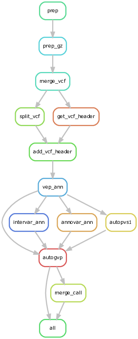

<!-- omit in toc -->
# Snakemake workflow to predict P/LP (pathogenic/likely pathogenic variants) using AutoGVP
Author: Wei Zhu (zhuw10@nih.gov) 

Date: 2023-08-21 14:30:53

---
- [Introduction](#introduction)
- [Methods](#methods)
  - [The major components of the Snakemake workflow](#the-major-components-of-the-snakemake-workflow)
  - [Get it started](#get-it-started)
  - [Layout of the workspace and the worklfow](#layout-of-the-workspace-and-the-worklfow)
  - [Revisions to run AutoGVP](#revisions-to-run-autogvp)
    - [Input VCF files](#input-vcf-files)
    - [Vep](#vep)
    - [Intervar](#intervar)
    - [autopvs1](#autopvs1)
    - [AnnoVar](#annovar)
    - [Prepare ClinVar data for the use of hg19](#prepare-clinvar-data-for-the-use-of-hg19)
    - [Run AutoGVP](#run-autogvp)
    - [Output](#output)
  - [Annotation data sources used in this analysis.](#annotation-data-sources-used-in-this-analysis)
- [Updates](#updates)
  - [Update on June 4, 2024](#update-on-june-4-2024)
    - [Download latest ClinVar database for hg38](#download-latest-clinvar-database-for-hg38)
    - [Run snakemake workflow with hg38 setting](#run-snakemake-workflow-with-hg38-setting)

---

## Introduction 

This new Snakemake workflow is to annotate variants using [AutoGVP](https://github.com/diskin-lab-chop/AutoGVP/tree/main).  It splits the input vcf files in multiple chunks as the [original pipeline](https://github.com/NCI-CGR/PLP_prediction_workflow/tree/main).  The main AutoGVP worflow followed Jung's design (/data/CGB_share/autoGVP_submit.sh @ biowulf).




---

## Methods


### The major components of the Snakemake workflow
+ [environment.yaml](./environment.yaml)
+ [Configure file](config/genomel_config.yaml)
+ [Snakefile](workflow/Snakefile)
+ [The wrapper script to launch the workflow at Biowulf](./run_it2.sh)

```bash
#!/bin/bash
#SBATCH --time=2-00:00:00
#SBATCH -o ${PWD}/snakemake.%j.out
#SBATCH -e ${PWD}/snakemake.%j.err


module load singularity

mkdir -p TMP
export TMPDIR=TMP

# conda activate snakemake
snakemake --profile workflow/profiles/biowulf --verbose -p --use-conda --jobs 400 --default-resources "mem_mb=10000  " --use-envmodules --use-singularity --singularity-args " -B /vf,/spin1,/data,/fdb,/gpfs "  --latency-wait 120 -T 0 -s workflow/Snakefile --configfile $1
```

### Get it started
```bash
### Create the conda env AutoGVP
conda env create -f PLP_prediction_workflow/environment.yaml

### activate the workflow
conda activate AutoGVP

### Launch the workflow
sbatch -J hkbc --export=ALL --mem=12g -p norm -o ${PWD}/slurm-%j.out -e ${PWD}/slurm-%j.err --time=24:00:00 --wrap='./run_it2.sh config/HKBC_Dec2024.yaml'
```


### Layout of the workspace and the worklfow
+ /data/GenoMEL/AutoGVP/AutoGVP/data
  + Homo_sapiens_assembly19.fasta
  + clinvar_20231230.vcf.gz
  + clinvar_20231230.vcf.gz
  + variant_summary.txt.gz
  + ClinVar-selected-submissions.tsv
+ /data/GenoMEL/PLP_prediction_workflow [working directory]
  + run_it2.sh
  + config/genomel_config.yaml
  + workflow/Snakefile
  + output/
    + merge_call


### Revisions to run AutoGVP
As the original *AutoGVP* pipeline has not been designed and tested for hg19, we made some minor revisions in certain steps. 

#### Input VCF files
There is no special requirement by AutoGVP for the VCF input files: it could one or multiple-part VCF file(s) and the parent folder of the vcf file(s) should be specified as *vcf_input_dir* in the configure file.  

If the input files are individual VCF file for each sample/subject, those VCF files should be merged before employing this workflow. Generally, we do not want repeat the annotation process for each sample; it is more efficient to apply annotation on the joint variant call output. 

We removed the original annotation and the format columns to reduce file size and avoid any conflict due to the existing annotations.  This step has been built in the workflow.
```bash
bcftools view -e 'ALT="*"' -Ou {input} |bcftools norm -m-both -Ou --threads {threads} | bcftools norm -f {params.ref} | bcftools annotate -Ou -x ID  -I +"%CHROM:%POS:%REF:%ALT" --threads {threads} | bcftools annotate -Oz -x FORMAT,^INFO/AC,^INFO/AF,^INFO/AN -o {output.vcf}
      tabix -p vcf {output.vcf}
```

#### Vep 
The module "VEP/104" is used for the Vep annotation at Biowulf, as suggested by Jung.  We introduced parameter *{params.grc}* ("GRCh37" is used for hg19):
+ --fasta $VEP_CACHEDIR/{params.grc}.fa
+ --assembly {params.grc}

#### Intervar 
In this step, we used locally installed InterVar for the standard configure setting (where instervar databases under intervardb were used):
+ [/home/zhuw10/git/InterVar-2.2.1/config.ini](./data/intervar_config.ini) 

In the workflow, we had introduced the setting from the module *annovar* to reduce the dependencies on the local settings at Biowulf:
```bash
/home/zhuw10/git/InterVar-2.2.1/Intervar.py -i {input.vcf} --input_type=VCF -o {params.prefix} -b {params.genome} -t /home/zhuw10/git/InterVar-2.2.1/intervardb -d $ANNOVAR_DATA/{params.genome} --table_annovar=$ANNOVAR_HOME/table_annovar.pl --convert2annovar=$ANNOVAR_HOME/convert2annovar.pl --annotate_variation=$ANNOVAR_HOME/annotate_variation.pl
```

As InterVar-2.2.1 biowulf module is available now, we replaced the locally install version with the new biowulf module adaptation: 
```bash
rule intervar_ann:
    input: 
        vcf = output_dir+"/vep_ann/{chunk}_VEP.vcf"
    output:
        multiext(output_dir+"/intervar_ann/{chunk}_VEP." + genome + "_multianno",  ".txt", ".txt.grl_p", ".txt.intervar")
    envmodules: "annovar", "intervar/2.2.1"
    params: 
        genome=genome,
        prefix= output_dir+"/intervar_ann/{chunk}_VEP"
    shell: """
        Intervar.py -i {input.vcf} --input_type=VCF -o {params.prefix} -b {params.genome} -t $INTERVAR_DATA/intervardb -d $ANNOVAR_DATA/{params.genome} --table_annovar=$ANNOVAR_HOME/table_annovar.pl --convert2annovar=$ANNOVAR_HOME/convert2annovar.pl --annotate_variation=$ANNOVAR_HOME/annotate_variation.pl
    """
```


#### autopvs1

We made a revision at data/autoPVS1_from_VEP_vcf.py to introduce genome_version option back to the python script:

```bash
### clone autoPVS1 repo under PLP_prediction_workflow and copy the revised code to replace the original one
git clone https://github.com/d3b-center/D3b-autoPVS1.git
cp data/autoPVS1_from_VEP_vcf.py D3b-autoPVS1/


# python /data/CGB_share/autopvs1_wz/autoPVS1_from_VEP_vcf.py --genome_version {params.genome} --vep_vcf {input.vcf} > {output}

python ./D3b-autoPVS1/autoPVS1_from_VEP_vcf.py --genome_version {params.genome} --vep_vcf {input.vcf} > {output}
```

Besides, we had copied the reference genomes to the folder /data/CGB_share/autopvs1_wz/data, and revised the file [config.ini](data/autopvs1_config.ini) accordingly for autopvs1.

#### AnnoVar
We used the annovar module installed at Biowulf with the data sets  "--protocol *gnomad211_exome*,*gnomad211_genome*", which are opted for the WES data on hg19.

:bookmark: this setting needs to be customized for other studies in the future.

#### Prepare ClinVar data for the use of hg19
To run AutoGVP, latest ClinVar data need to be downloaded and prepared. 

```bash
cd /data/GenoMEL/AutoGVP
git clone git@github.com:diskin-lab-chop/AutoGVP.git


wget -nc -e robots=off --reject "index.html*" -r --level=1  -nd -np -A "clinvar_20231230.vcf.gz*" -P data/ https://ftp.ncbi.nlm.nih.gov/pub/clinvar/vcf_GRCh37/

wget https://ftp.ncbi.nlm.nih.gov/pub/clinvar/tab_delimited/submission_summary.txt.gz -P data/

wget https://ftp.ncbi.nlm.nih.gov/pub/clinvar/tab_delimited/variant_summary.txt.gz -P data/

ls -al data/
total 514410
drwxr-s--- 2 zhuw10 GenoMEL      4096 Jan  4 11:02 .
drwxr-sr-x 2 zhuw10 GenoMEL      4096 Jan  4 10:56 ..
-rw-r--r-- 1 zhuw10 GenoMEL  91217146 Dec 31 02:44 clinvar_20231230.vcf.gz
-rw-r--r-- 1 zhuw10 GenoMEL       126 Dec 31 02:44 clinvar_20231230.vcf.gz.md5
-rw-r--r-- 1 zhuw10 GenoMEL    522144 Dec 31 02:44 clinvar_20231230.vcf.gz.tbi
-rw-r--r-- 1 zhuw10 GenoMEL 211364657 Dec 30 19:27 submission_summary.txt.gz
-rw-r--r-- 1 zhuw10 GenoMEL 223649945 Dec 31 00:33 variant_summary.txt.gz

### run select-clinVar-submissions_hg19.R
# to have ClinVar-selected-submissions.tsv
module load singularity
singularity pull docker://pgc-images.sbgenomics.com/naqvia/autogvp:latest

singularity exec -B $PWD:/share  --pwd /share autogvp_latest.sif Rscript ./AutoGVP/scripts/select-clinVar-submissions_hg19.R --variant_summary data/variant_summary.txt.gz --submission_summary data/submission_summary.txt.gz --outdir data/
```

#### Run AutoGVP
After all the input files prepared for the use of hg19, AutoGVP is ready to be launched via container *docker://pgc-images.sbgenomics.com/naqvia/autogvp:latest*

#### Output
The final merged tab-delimited files are generated under output. The format is as [described](https://github.com/diskin-lab-chop/AutoGVP/tree/main#autogvp-output), with one additional column "vid" (e.g., 1:12198:G:C). 
```bash
tree output/merge_call/
output/merge_call/
├── genomel.autogvp_abridged.tsv
└── genomel.autogvp_full.tsv


```


---

### Annotation data sources used in this analysis.

+ Table 1. Comparison of the annotation tools used between AutoGVP and the original P/LP prediction workflow.
  
| Annotation Tool | AutoGVP                          | Original P/LP prediction pipeline                                                                                                                                                       |
|-----------------|----------------------------------|-----------------------------------------------------------------------------------------------------------------------------------------------------------------------------------------|
| VEP             | VEP/104 (/fdb/VEP/104/cache)     | NA                                                                                                                                                                                      |
| snpEff          | NA                               | snpEff/5.1d                                                                                                                                                                             |
| annovar         | annovar/2020-06-08               | annovar/2020-06-08                                                                                                                                                                      |
|   --protocols   | gnomad211_exome,gnomad211_genome | refGene,knownGene,ensGene,exac03nontcga,gnomad211_exome,gnomad211_genome,esp6500siv2_all,1000g2015aug_all,clinvar_20210123,dbnsfp41a,dbscsnv11,spliceai_filtered,spidex,cosmic92_coding |
| InterVar        | Version 2.2.1                    | Version 2.2.1                                                                                                                                                                           |
| ClinVar         | clinvar_20231230                 | clinvar_20210123 (via annovar)                                                                                                                                                          |
| AutoPSV1        | v2.0-2-g7fb1be9                  | NA                                                                                                                                                                                      |

:bookmark: It is noted that annotation approaches are significantly different between the two workflows, but the same version of InterVar were used.  One of the differences to be highlighted is the data source of the ClinVar: *clinvar_20210123* was used and annotated variants via AnnoVar in [the original P/LP prediction workflow](https://github.com/NCI-CGR/PLP_prediction_workflow/tree/main), whereas *clinvar_20231230* was used directly by *AutoGVP*.

---

## Updates

### Update on June 4, 2024
AutoGVP has been updated due to [a revison in the recent ClinVar release](https://github.com/diskin-lab-chop/AutoGVP/issues/242), and a new docker image is released: 
+ docker://pgc-images.sbgenomics.com/diskin-lab/autogvp:v1.0.1
   
Accordingly, we updated our Snakemake workflow and also added one example to run AutoGVP with the hg38 reference genome. 

#### Download latest ClinVar database for hg38
```bash
cd /data/GenoMEL/AutoGVP
mkdir clinvar_20240603

### Download the latest data
wget -nc -e robots=off --reject "index.html*" -r --level=1  -nd -np -A "clinvar_20240603.vcf.gz*" -P clinvar_20240603/ https://ftp.ncbi.nlm.nih.gov/pub/clinvar/vcf_GRCh38/

wget https://ftp.ncbi.nlm.nih.gov/pub/clinvar/tab_delimited/submission_summary.txt.gz -P clinvar_20240603/

wget https://ftp.ncbi.nlm.nih.gov/pub/clinvar/tab_delimited/variant_summary.txt.gz -P clinvar_20240603/

ls -al clinvar_20240603/
total 623525
drwxr-s---. 2 zhuw10 GenoMEL      4096 Jun  4 10:07 .
drwxr-sr-x. 2 zhuw10 GenoMEL      4096 Jun  4 10:01 ..
-rw-r-----. 1 zhuw10 GenoMEL 101041151 Jun  4 09:08 clinvar_20240603.vcf.gz
-rw-r-----. 1 zhuw10 GenoMEL       126 Jun  4 09:08 clinvar_20240603.vcf.gz.md5
-rw-r-----. 1 zhuw10 GenoMEL    534810 Jun  4 09:08 clinvar_20240603.vcf.gz.tbi
-rw-r-----. 1 zhuw10 GenoMEL 260853747 Jun  3 14:31 submission_summary.txt.gz
-rw-r-----. 1 zhuw10 GenoMEL 276058849 Jun  4 09:07 variant_summary.txt.gz


### Run select-clinVar-submissions.R

module load singularity
# https://github.com/diskin-lab-chop/AutoGVP
singularity pull docker://pgc-images.sbgenomics.com/diskin-lab/autogvp:v1.0.1

### Output data/ClinVar-selected-submissions.tsv
singularity exec -B $PWD:/share  --pwd /share autogvp_v1.0.1.sif Rscript ./AutoGVP/scripts/select-clinVar-submissions.R --variant_summary clinvar_20240603/variant_summary.txt.gz --submission_summary clinvar_20240603/submission_summary.txt.gz --outdir clinvar_20240603/
# Warning message:
# In left_join(., variant_summary_df, by = "VariationID", multiple = "all",  :
#   Detected an unexpected many-to-many relationship between `x` and `y`.
# ℹ Row 25499 of `x` matches multiple rows in `y`.
# ℹ Row 2 of `y` matches multiple rows in `x`.
# ℹ If a many-to-many relationship is expected, set `relationship =
#   "many-to-many"` to silence this warning.


ls -altr clinvar_20240603/
total 2115825
-rw-r----- 1 zhuw10 GenoMEL  260853747 Jun  3 14:31 submission_summary.txt.gz
-rw-r----- 1 zhuw10 GenoMEL  276058849 Jun  4 09:07 variant_summary.txt.gz
-rw-r----- 1 zhuw10 GenoMEL     534810 Jun  4 09:08 clinvar_20240603.vcf.gz.tbi
-rw-r----- 1 zhuw10 GenoMEL        126 Jun  4 09:08 clinvar_20240603.vcf.gz.md5
-rw-r----- 1 zhuw10 GenoMEL  101041151 Jun  4 09:08 clinvar_20240603.vcf.gz
drwxr-sr-x 2 zhuw10 GenoMEL       4096 Jun  4 10:01 ..
drwxr-s--- 2 zhuw10 GenoMEL       4096 Jun  4 10:14 .
-rw-r----- 1 zhuw10 GenoMEL 1528115185 Jun  4 10:14 ClinVar-selected-submissions.tsv
```

#### Run snakemake workflow with hg38 setting
+ /data/GenoMEL/PLP_prediction_workflow
  + config/UKB_June2024.yaml
```yml
# given a list vcf file under the folder
vcf_input_dir: "/data/GenoMEL/UKB/final_vcf"

### output_dir is sufficient to keep data unique and output_prefix is to for the merged file
output_dir: "/data/GenoMEL/PLP_prediction_workflow/output_June2024"
output_prefix: "UKB"
# ref: "/data/GenoMEL/AutoGVP/AutoGVP/data/Homo_sapiens_assembly19.fasta"
ref: /data/zhuw10/ukbb/ref/GRCh38_full_analysis_set_plus_decoy_hla.fa
genome: "hg38"
genome_GRC: "GRCh38"
clinvar:
  dir: "/data/GenoMEL/AutoGVP/clinvar_20240603"
  vcf: "clinvar_20240603.vcf.gz"
  selected_submission: "ClinVar-selected-submissions.tsv"
  variant_summary: "variant_summary.txt.gz"
  submission_summary: "submission_summary.txt.gz"
conceptIDs: "/data/GenoMEL/AutoGVP/AutoGVP/data/clinvar_cpg_concept_ids.txt"
split_total: 100
```


```bash
conda activate snakemake

cd /data/GenoMEL/PLP_prediction_workflow

snakemake -np -s workflow/Snakefile --configfile config/UKB_June2024.yaml --verbose 


sbatch -J autogvs --export=ALL --mem=12g -p norm -o ${PWD}/slurm-%j.out -e ${PWD}/slurm-%j.err --time=24:00:00 --wrap='./run_it2.sh config/UKB_June2024.yaml'

ls -alt output_June2024/
total 14158
drwxr-s--- 2 zhuw10 GenoMEL     4096 Jun  4 11:12 merge_call
drwxr-s--- 2 zhuw10 GenoMEL     4096 Jun  4 11:10 .
drwxr-s--- 2 zhuw10 GenoMEL     4096 Jun  4 11:08 autogvp
drwxr-s--- 2 zhuw10 GenoMEL     4096 Jun  4 11:06 intervar_ann
drwxr-s--- 2 zhuw10 GenoMEL     4096 Jun  4 11:04 vep_ann
drwxr-s--- 2 zhuw10 GenoMEL     4096 Jun  4 11:03 annovar_ann
drwxr-s--- 2 zhuw10 GenoMEL     4096 Jun  4 11:01 autopvs1
drwxr-s--- 2 zhuw10 GenoMEL     4096 Jun  4 10:39 splitted
-rw-r----- 1 zhuw10 GenoMEL     6844 Jun  4 10:28 UKB.vcf.gz.tbi
-rw-r----- 1 zhuw10 GenoMEL 14489781 Jun  4 10:28 UKB.vcf.gz
drwxr-s--- 2 zhuw10 GenoMEL     4096 Jun  4 10:26 prep
drwxr-s--- 2 zhuw10 GenoMEL     4096 Jun  4 10:26 ..

csvtk cut -t -f autogvp_call output_June2024/merge_call/UKB.autogvp_abridged.tsv | csvtk del-header | sort | uniq -c
   7966 Benign
  12038 Likely_benign
    976 Likely_pathogenic
    819 Pathogenic
1102177 Uncertain_significance

csvtk cut -t -f autogvp_call_reason output_June2024/merge_call/UKB.autogvp_abridged.tsv | csvtk del-header | sort | uniq -c
   14536 ClinVar
1109440 InterVar

csvtk pretty -t  output_april2024/merge_call/UKB.autogvp_abridged.tsv| less -S 

csvtk filter2 -t -f '$autogvp_call == "Pathogenic" ' output_June2024/merge_call/UKB.autogvp_abridged.tsv
```